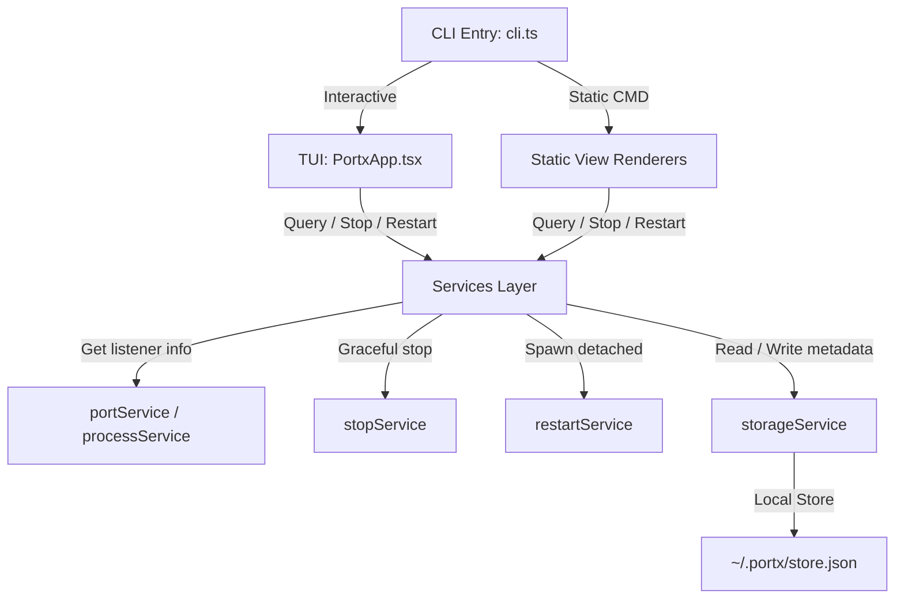

# Product Requirements Document (PRD) — Portx

## 1. Product Vision & Goals

**Portx** is a lightweight, developer-first command-line utility for macOS to inspect, stop, and restart processes running on local ports. 

Unlike heavy web dashboards or bloated resource-intensive desktop tools, Portx focuses strictly on the terminal experience. It provides high information density with exceptional visual restraint, taking aesthetic inspiration from premium macOS CLI utilities like **Mole**.

### Core Value Proposition
- **Lightweight & Fast** — Zero background daemons, zero battery drain, and near-instant startup.
- **Developer-Native** — Uses keyboard-driven ergonomics, standard vim navigation (`j`/`k`, `g`/`G`), and interactive searches.
- **Intelligent Focus** — Filters out common macOS system noise (such as background system daemons, local loopbacks, and low ports) to expose only active development environments.

---

## 2. Core Philosophy & Design Aesthetics

Portx is built around the principles of **restraint, minimalism, and craftsmanship**:

1. **Restraint over Features** — Keep functionality narrow: listing, inspecting, stopping, and restarting. Do not overengineer or turn this into an analytical dashboard.
2. **Whitespace as a Separator** — Emphasize breathing room over dense lines or boxes. Rely on vertical spacing and consistent horizontal columns to guide the developer’s eye.
3. **Muted Color Contrast** — Avoid default harsh terminal colors. Use a cohesive, highly specific 7-color palette (softer green, muted cyan, deep dim grays) to create a premium, calm hacking aesthetic.
4. **Micro-Animations & Smooth State Transitions** — Instantly respond to user actions. Handle keyboard interaction and input updates without layout shifting or visible cursor flicker.

---

## 3. Target Audience & Prerequisites

### Target Audience
- macOS developers who run multiple local development environments (e.g., Node.js, Vite, Next.js, Django, Rails, Go, Docker) and frequently run into "port already in use" errors or need to manage active local services.

### System & Environment Requirements
- **Operating System:** macOS (relies on native `lsof` and `ps` utilities for speed and accuracy).
- **Runtime Environment:** Node.js `>= 20.0.0`
- **TUI Execution:** A terminal emulator with Unicode and truecolor support.

### Frictionless Distribution
- **One-Line Installer:** Must support a fully automated, one-line installation process via `curl | bash` without requiring manual build step orchestration.
- **Installer Actions:** The script must verify macOS usage, validate that a compatible Node.js and NPM version are available, automatically determine write access configuration to run globally, and install `portx` with styled feedback.

---

## 4. Functional Requirements

### 4.1. Intelligent Port Discovery (`portx list`)
- **Noise Filtering:** Automatically hide macOS-specific background services, standard low system ports ($< 1024$), and internal loopback processes.
- **Project Detection:** Prioritize processes running from subdirectories of the user's home folder (`~/`) or utilizing common development runtimes:
  - `node`, `npm`, `pnpm`, `yarn`, `bun`
  - `vite`, `next`, `nuxt`
  - `python`, `pipenv`, `poetry`
  - `rails`, `ruby`
  - `go run`, `go`
  - `docker-proxy`, `docker`
- **Static Output:** Present a beautiful, space-aligned, lightweight text table of active ports, showing Port, PID, Process Name, Project Folder, and exact Directory path.

### 4.2. Process Inspection & Context Caching (`portx inspect <port>`)
- Inspect a specific port and fetch its running details (Port, PID, Process name, Command, Directory, Status).
- **Metadata Caching:** Whenever a port is successfully inspected or listed, Portx must cache its startup context (command used to execute it, current working directory, and PID) in a lightweight local file.

### 4.3. Safe Process Termination (`portx stop <port>`)
- Gracefully shut down the process listening on a specified port.
- Send a standard `SIGTERM` to allow the process to perform cleanup tasks.
- Monitor the target process; if it fails to exit within a short grace period, fallback to force-killing via `SIGKILL`.

### 4.4. Decoupled Re-Spawning (`portx restart <port>`)
- Stop the current listener process running on a specific port.
- Retrieve the cached context (working directory and exact startup command) from storage.
- Re-spawn the command as a detached, independent process from Portx so it continues to run in the background as an independent server.
- Fail gracefully with an explicit, helpful error message if no restart metadata is stored for that port.

### 4.5. Interactive TUI (`portx`)
An interactive keyboard-driven Terminal User Interface that orchestrates the above flows in a fluid view.

#### Navigation & Commands

| Action | Control Key | Behavioral Requirement |
| :--- | :--- | :--- |
| **Move Cursor** | `j`/`k` or `↓`/`↑` | Seamless navigation through the list with zero cursor flicker. Selected row highlights softly using brightness shift. |
| **Inspect Details** | `Enter` | Shows a dedicated detail card on the right-hand panel for the selected port. |
| **Stop Process** | `x` | Triggers a confirmation state before sending termination signals to prevent accidental stops. |
| **Restart Process**| `r` | Performs an in-place restart. Shows transient status indicators (e.g. success or failure notice) upon completion. |
| **Filter & Search** | `/` | Opens a live text query bar. Filters list in real-time. Typing `q` must enter text, not quit the app. |
| **Fast Jumps** | `g` / `G` | Jump instantly to the first or last port in the list. |
| **Navigate Back** | `Esc` | Clears search query, or backs out of detail/confirmation states. |
| **Exit** | `q` | Immediately terminates the TUI and restores terminal settings. |

---

## 5. Non-Functional Requirements

### 5.1. Performance & Speed
- **Startup Latency:** Interactive TUI and CLI static commands must initialize in less than **100ms**.
- **No Background Resource Consumption:** No background watcher process or polling agent. Portx only computes when explicitly invoked.
- **Efficient Updates:** List view refreshes incrementally every few seconds and bypasses layout re-renders if no state change is detected.

### 5.2. Robustness & Reliability
- **Terminal State Safety:** Terminal cursor must be hidden programmatically on interactive startup and gracefully restored on exit—even if the app crashes or exits abruptly via uncaught exceptions.
- **Graceful Error Handling:** Command failures, empty states, missing configuration parameters, and missing metadata states must result in calm, explanatory notices instead of hard stack traces.

### 5.3. Architecture & Modularity
- **Decoupled Architecture:** Clean separation of concerns between core services (Port scanning, OS-level process management, storage APIs) and presentation rendering (static React-Ink terminal renderers and the interactive TUI state orchestrator).
- **Zero-Dependency Core:** Keep production npm dependencies strictly scoped to essentials (`ink` for reactive terminal layouts, `chalk` for colorized primitives, `commander` for command routing, `execa` for robust sub-process running, and `lowdb` for lightweight flat JSON storage).

---

## 6. Technical Specifications & File Map

### Metadata Storage Database
- **Path:** `~/.portx/store.json` (Customizable via environment variable: `PORTX_HOME`).
- **Schema:**
  ```json
  {
    "3000": {
      "cmd": "npm run dev",
      "cwd": "/Users/charan/projects/my-app",
      "pid": 8121
    }
  }
  ```

### System Architecture Flow



### Component Inventory

- **Core CLI Router:** `src/cli.ts` (Parses CLI arguments using Commander).
- **Services Layer:**
  - `portService.ts`: Parses active TCP network listeners on macOS.
  - `processService.ts`: Gets PID details, paths, and environment settings.
  - `projectPortFilter.ts`: Applies project heuristic logic to filter system ports.
  - `stopService.ts`: Executes SIGTERM and fallback SIGKILL logic.
  - `restartService.ts`: Decouples background processes during restart.
  - `storageService.ts`: Manages the lightweight local JSON database.
- **Presentation Layer (TUI Component Tree):**
  - `render.tsx`: Controls terminal cursor visibility and coordinates React-Ink render loops.
  - `theme.ts`: Centralizes the 7-color modern terminal palette.
  - `KeyValue.tsx`: Clean, padded, lowercase key-value pairs without colons.
  - `StatusLine.tsx`: Renders subtle dot indicators (`●`) for success/error/warning states.
  - `interactive/PortxApp.tsx`: Main interactive state orchestrator and keyboard key event routing.
  - `interactive/Header.tsx`: Renders minimal top breadcrumb and query status.
  - `interactive/PortList.tsx`: Displays list of active ports using space separation.
  - `interactive/InspectPanel.tsx`: Visualized metadata detail sheet.
  - `interactive/HelpBar.tsx`: Contextual bottom command helper keybar.
  - `interactive/NoticeBar.tsx`: Compact status alerts.

---

## 7. Future Considerations (Out of Scope)
- **Multi-OS Support:** Native Linux or Windows process parser integration (currently macOS-first).
- **Custom Project Rules:** Configurable user heuristics to whitelist or blacklist specific ports or directory paths.
- **Global Keybinding Listeners:** Triggering port views via a background shortcut without opening a console terminal.
